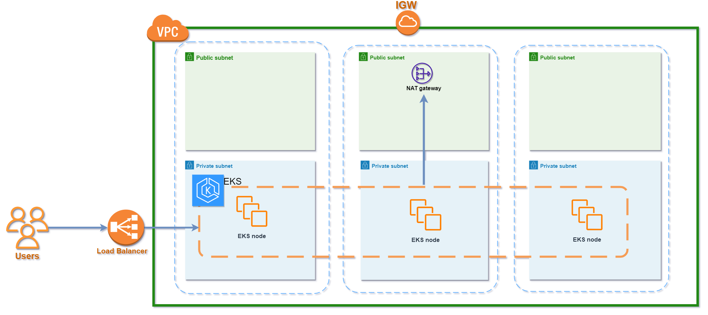
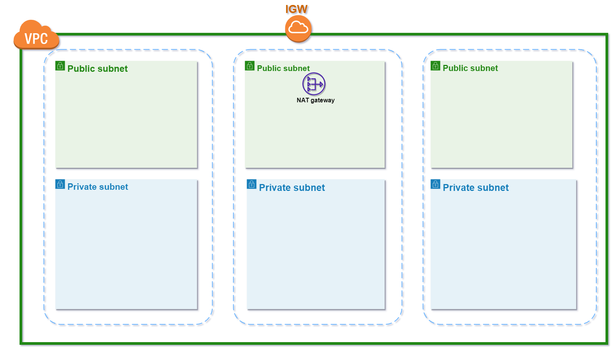

# eks-terraform


# AWS EKS Cluster Terraform module

## This module will create:
- _EKS Cluster_
- _EKS Node Group_

## **Diagram**



## **Usage**
```terraform
module "eks_cluster" {
  source = "path/to/this/module"

  env         = <env_name>
  vpc_id      = <vpc_id>
  eks_name    = "test1"
  eks_version = "1.20"
  subnets     = <list of Private Subnets>
  vpn_cidr    = <CIDR Block list of Public Subnets>
  region      = "us-east-1"

  node_groups = {
    first = {
      node_group_name = "test"
      desired_size    = 3
      max_size        = 4
      min_size        = 2

      ami_type       = "AL2_x86_64"
      instance_types = ["t2.medium"]
    },
  }
}
```

```bash
export AWS_ACCESS_KEY_ID=<write your access key id>
export AWS_SECRET_ACCESS_KEY=<write you secret access key>
export AWS_DEFAULT_REGION=<write default region to create resource in>
```

Then perform the following commands on the root folder:
- `terraform init` terraform initialization
- `terraform plan` to see the infrastructure plan
- `terraform apply` to apply infrastructure build
- `terraform destroy` to destroy the infrastructure

Commands for connecting to the EKS Cluster:
```bash
aws eks --region <eks_region> update-kubeconfig --name <eks_name>
```

## **Resources**
|Name|Type|
|----|----|
|[aws_eks_cluster.cluster](https://registry.terraform.io/providers/hashicorp/aws/latest/docs/resources/eks_cluster)|resource|
|[aws_eks_node_group.workers](https://registry.terraform.io/providers/hashicorp/aws/latest/docs/resources/eks_node_group)|resource|
|[aws_security_group.cluster](https://registry.terraform.io/providers/hashicorp/aws/latest/docs/resources/security_group)|resource|
|[aws_security_group_rule](https://registry.terraform.io/providers/hashicorp/aws/latest/docs/resources/security_group_rule)|resource
|[aws_security_group.worker_group_mgmt](https://registry.terraform.io/providers/hashicorp/aws/latest/docs/resources/security_group)|resource|
|[aws_iam_role.cluster](https://registry.terraform.io/providers/hashicorp/aws/latest/docs/resources/iam_role)|resource|
|[aws_iam_role_policy_attachment.cluster_AmazonEKSClusterPolicy](https://registry.terraform.io/providers/hashicorp/aws/latest/docs/resources/iam_role_policy_attachment)|resource|
|[aws_iam_role_policy_attachment.cluster_AmazonEKSServicePolicy](https://registry.terraform.io/providers/hashicorp/aws/latest/docs/resources/iam_role_policy_attachment)|resource|
|[aws_iam_role_policy_attachment.cluster_AmazonEKSVPCResourceControllerPolicy](https://registry.terraform.io/providers/hashicorp/aws/latest/docs/resources/iam_role_policy_attachment)|resource|
|[aws_iam_role.eks_node](https://registry.terraform.io/providers/hashicorp/aws/latest/docs/resources/iam_role)|resource|
|[aws_iam_role_policy_attachment.eks_node_AmazonEKSWorkerNodePolicy](https://registry.terraform.io/providers/hashicorp/aws/latest/docs/resources/iam_role_policy_attachment)|resource|
|[aws_iam_role_policy_attachment.eks_node_AmazonEKS_CNI_Policy](https://registry.terraform.io/providers/hashicorp/aws/latest/docs/resources/iam_role_policy_attachment)|resource|
|[aws_iam_role_policy_attachment.eks_node](https://registry.terraform.io/providers/hashicorp/aws/latest/docs/resources/iam_role_policy_attachment)|resource|

## **Inputs**
|Name|Description| Type| Default| Required|
|----|-----------|-----|--------|---------|
|`eks_name`|EKS Cluster name.|`string`|`EKS`|yes|
|`eks_version`|EKS Cluster version.|`string`|no|yes|
|`subnets`|Subnets list to create EKS in.|`list(string)`|no|yes|
|`node_groups`|Node groups to create.|`any`|`{}`|no|
|`vpc_id`|VPC ID to create EKS in.|`string`|no|yes|
|`bastion_cidr`|Public IP of Bastion host.|`list(string)`|`[""]`|yes|

## **Outputs**
|Name|Description|
|----|-----------|
|`eks_name`|EKS Cluster name.|
|`eks_certificate_authority`|Attribute block containing certificate-authority-data for your cluster.|
|`eks_endpoint`|Endpoint for your Kubernetes API server.|

<br /><br /><br /><br /><br />
-----------------------------------------------------------------------------------------------------

# AWS Networking Terraform module

## This module will create:
- _VPC_
- _Public Subnets_
- _Private Subnets_

## **Diagram**



## **Usage**
```terraform
module "networking" {
  source = "path/to/this/module"  # <== Path to  the networking module.

  vpc_cidr         = <vpc_cidr>
  public_sn_count  = 3
  private_sn_count = 3
}
```

```bash
export AWS_ACCESS_KEY_ID=<write your access key id>
export AWS_SECRET_ACCESS_KEY=<write you secret access key>
export AWS_DEFAULT_REGION=<write default region to create resource in>
```


Then perform the following commands on the root folder:
- `terraform init` terraform initialization
- `terraform plan` to see the infrastructure plan
- `terraform apply` to apply infrastructure build
- `terraform destroy` to destroy the infrastructure


## **Resources**
| Name | Type |
|------|------|
|[aws_vpc.vpc](https://registry.terraform.io/providers/hashicorp/aws/latest/docs/resources/vpc)| resource|
|[aws_internet_gateway.igw](https://registry.terraform.io/providers/hashicorp/aws/latest/docs/resources/internet_gateway)| resource|
|[random_integer.random](https://registry.terraform.io/providers/hashicorp/random/latest/docs/resources/integer)| resource|
|[aws_subnet.public_subnets](https://registry.terraform.io/providers/hashicorp/aws/latest/docs/resources/subnet)|resource|
|[aws_subnet.private_subnets](https://registry.terraform.io/providers/hashicorp/aws/latest/docs/resources/subnet)|resource|
|[aws_route_table.public_route_table](https://registry.terraform.io/providers/hashicorp/aws/latest/docs/resources/route_table)|resource|
|[aws_route.public_igw](https://registry.terraform.io/providers/hashicorp/aws/latest/docs/resources/route)|resource|
|[aws_route_table_association.public_assoc](https://registry.terraform.io/providers/hashicorp/aws/latest/docs/resources/route_table_association)|resource|
|[aws_route_table.private_route_table](https://registry.terraform.io/providers/hashicorp/aws/latest/docs/resources/route_tablea)|resource|
|[aws_route.private_nat_gateway](https://registry.terraform.io/providers/hashicorp/aws/latest/docs/resources/route)|resource|
|[aws_route_table_association.private_assoc](https://registry.terraform.io/providers/hashicorp/aws/latest/docs/resources/route_table_association)|resource|
|[aws_nat_gateway](https://registry.terraform.io/providers/hashicorp/aws/latest/docs/resources/nat_gateway)|resource|
|[aws_eip.nat_eip](nat_eip)|resource|

## **Inputs**
| Name| Description| Type| Default| Required |
|-----|------------|-----|--------|----------|
|``vpc_cidr`` | The IPv4 CIDR block for the VPC. | `string` | `no` | yes |
| ``public_sn_count`` | Amount of Public Subnets to create | `number` | `no` | yes|
|``private_sn_count`` | Amount of Private Subnets to create | `number` | `no` | yes|
| ``max_subnets`` | Max amount of subnets | `number` | `20` | no |
| `env`| Environment name to create resource in.| `string` | no | yes|

## **Outputs**
|Name|Description|
|----|-----------|
|`vpc_id`|The ID of the VPC.|
|`public_subnets`|The IDs of Public Subnets.|
|`private_subnets`|The IDs of the Private Subnets.|

<br /><br /><br /><br /><br />


-------------------------------------------------------------------------------------------------------

# AWS Module for Terraform S3 Buckets

## This module will create:
- _s3 Bucket_

## **Usage**
```terraform
module "backend" {
  source = "path/to/this/module"
  env    = "test"
  client = "<client_name>"
}
```
```bash
export AWS_ACCESS_KEY_ID=<write your access key id>
export AWS_SECRET_ACCESS_KEY=<write you secret access key>
export AWS_DEFAULT_REGION=<write default region to create resource in>
```

Then perform the following commands on the root folder:
- `terraform init` terraform initialization
- `terraform plan` to see the infrastructure plan
- `terraform apply` to apply infrastructure build
- `terraform destroy` to destroy the infrastructure

# **Resources**
|Name | Type|
|-----|-----|
|[aws_s3_bucket.bucket](https://registry.terraform.io/providers/hashicorp/aws/latest/docs/resources/s3_bucket)|resource|
|[aws_s3_bucket_public_access_block.public_access](https://registry.terraform.io/providers/hashicorp/aws/latest/docs/resources/s3_account_public_access_block)|resource|
|[aws_s3_bucket_acl.bucket_acl](https://registry.terraform.io/providers/hashicorp/aws/latest/docs/resources/s3_bucket_acl)|resource|
|[aws_s3_bucket_server_side_encryption_configuration.bucket_encryption](https://registry.terraform.io/providers/hashicorp/aws/latest/docs/resources/s3_bucket_server_side_encryption_configuration)|resource|
|[aws_s3_bucket_versioning.bucket_versioning](https://registry.terraform.io/providers/hashicorp/aws/latest/docs/resources/s3_bucket_versioning)|resource|
|[aws_kms_key.key](https://registry.terraform.io/providers/hashicorp/aws/latest/docs/resources/kms_key)|resource|
|[aws_kms_alias.alias](https://registry.terraform.io/providers/hashicorp/aws/latest/docs/resources/kms_alias)|resource|


# **Inputs**
|Name|Description|Type|Default|Required|
|----|-----------|----|-------|--------|
|`tags`|A mapping of tags to assign.|`map(string)`|`{}`|no|
|`env`|Environment name to create resource in.|`string`|no|yes|
|`bucket_versioning`|The bucket and all objects should be destroyed when using true.|`bool`|`true`|yes|
|`kms_enable_key_rotation`|Enable key rotation for the KMS key.|`bool`|`false`|no|

# **Outputs**
|Name|Description|
|----|-----------|
|`bucket_name`|Bucket name.|
